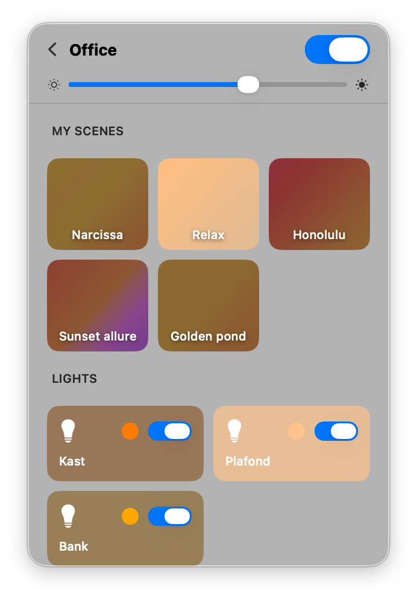
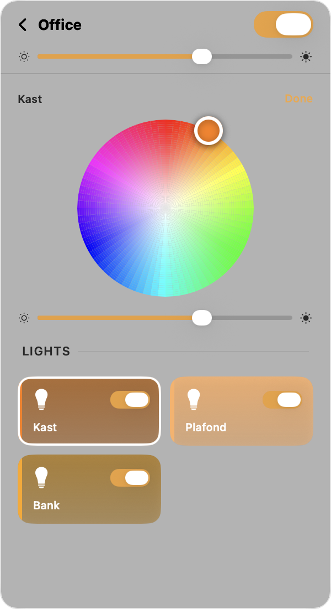
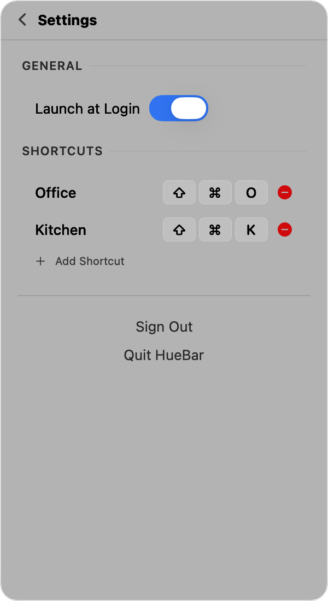

# HueBar

A native macOS menubar app for controlling your Philips Hue lights. Toggle rooms, adjust brightness and colors, activate scenes, set up global keyboard shortcuts, and automate lights on sleep/wake — all from your menu bar. Built with SwiftUI, zero dependencies.

<p>
  
  
  
  
</p>

## Why HueBar?

Philips discontinued the official Hue macOS app years ago, and most third-party alternatives are closed-source, use older APIs, or require a paid license. HueBar is a free, open-source alternative built on the modern [CLIP API v2](https://developers.meethue.com/develop/hue-api-v2/) with real-time updates via Server-Sent Events. It's native SwiftUI with zero external dependencies — just a lightweight menubar app that does what you need.

## Features

- 💡 **Rooms & Zones** — View all your Hue rooms and zones with on/off toggles
- 🎚️ **Brightness Control** — Adjust brightness per room/zone with a slider
- 🎨 **Scene Selection** — Browse and activate saved scenes in a color-coded grid
- 💡 **Individual Lights** — See and control each light in a room with per-light on/off toggles and brightness
- 🎨 **Color Picker** — Full color wheel and color temperature slider for individual lights
- 📌 **Pin & Reorder** — Pin favorite rooms/zones to the top and reorder them with drag-and-drop
- ⌨️ **Global Keyboard Shortcuts** — Assign system-wide hotkeys to toggle any room or zone on/off, even when HueBar isn't focused
- 😴 **Sleep/Wake Automation** — Automatically turn rooms off when your Mac sleeps and back on when it wakes, with optional scene recall
- 🔄 **Real-time Updates** — Live state updates via Server-Sent Events (SSE) from the Hue Bridge
- 🚀 **Launch at Login** — Optional auto-start on login, configurable from the menu
- 🔍 **Auto-discovery** — Finds your Hue Bridge automatically via mDNS and cloud discovery with retry
- 🔒 **Secure** — TLS with Signify root CA pinning, IP validation, credentials stored locally with restricted permissions
- 🪶 **Lightweight** — Native SwiftUI, no external dependencies, lives in your menu bar

## Requirements

- macOS 15.0 (Sequoia) or later
- A Philips Hue Bridge on your local network

## Installation

### Download a release (easiest)

1. Go to [Releases](https://github.com/jurre/huebar/releases) and download the latest `HueBar.zip`
2. Unzip the file and move `HueBar.app` to your `/Applications` folder
3. On first launch, **right-click → Open** (the app is ad-hoc signed, so Gatekeeper will ask once)

### Install from source

```bash
git clone https://github.com/jurre/huebar.git
cd huebar
./scripts/install.sh
```

This builds a release binary, wraps it in a `.app` bundle, code-signs it, and copies it to `/Applications`. You can then launch HueBar from Spotlight or Finder.

To start automatically on login, toggle **"Launch at Login"** in the HueBar menu.

### Run from source

```bash
swift run
```

## Setup

1. Launch HueBar — a lightbulb icon appears in your menu bar
2. The app will search for your Hue Bridge on the network
3. When your bridge is found, click it and press the **link button** on your physical Hue Bridge
4. That's it — your rooms and zones appear with toggle switches, brightness sliders, scene selection, and individual light controls

## Keyboard Shortcuts

HueBar supports global keyboard shortcuts to toggle rooms and zones without opening the menubar:

1. Click the ⚙️ gear icon in HueBar to open **Settings**
2. In the **Keyboard Shortcuts** section, click **Add Shortcut**
3. Select a room or zone, then press your desired key combination (e.g. `⌃⌥L`)
4. The shortcut works system-wide — press it from any app to toggle that room on or off

Shortcuts are registered via Carbon `RegisterEventHotKey` and do not require Accessibility permissions.

## Sleep/Wake Automation

HueBar can automatically control rooms when your Mac sleeps and wakes — great for office lights or desk lamps:

1. Click the ⚙️ gear icon in HueBar to open **Settings**
2. In the **Sleep / Wake** section, click **Add Rule**
3. Select a room or zone, then choose a mode:
   - **Sleep** — turn off when Mac sleeps
   - **Wake** — turn on when Mac wakes
   - **Both** — turn off on sleep, turn on on wake
4. Optionally select a scene to recall on wake instead of just turning the lights on

## Architecture

HueBar uses the [Hue CLIP API v2](https://developers.meethue.com/develop/hue-api-v2/) for modern resource-based control. No external dependencies — only Apple frameworks:

- **SwiftUI** — `MenuBarExtra` with `.window` style for the popover UI
- **Network** — `NWBrowser` for mDNS bridge discovery
- **Foundation** — `URLSession` for HTTPS communication

```
Sources/HueBar/
├── HueBarApp.swift                # App entry point, MenuBarExtra
├── Info.plist                     # App metadata and permissions
├── Views/
│   ├── MenuBarView.swift          # Main room list, navigation, footer
│   ├── RoomDetailView.swift       # Scene grid + light grid for a room/zone
│   ├── LightDetailView.swift      # Per-light brightness, color wheel, temperature
│   ├── LightCard.swift            # Individual light card (on/off, icon, color dot)
│   ├── LightRowView.swift         # Room/zone row card with gradient background
│   ├── SceneCard.swift            # Scene card with palette gradient
│   ├── ColorWheelView.swift       # CIE xy color wheel picker
│   ├── ColorTemperatureSlider.swift # Mirek color temperature slider
│   ├── SetupView.swift            # Bridge discovery & link-button auth flow
│   ├── SettingsView.swift         # Settings (push-navigation in popover)
│   ├── ShortcutsSettingsView.swift # Keyboard shortcut management
│   ├── SleepWakeSettingsView.swift # Sleep/wake automation management
│   └── KeyRecorderView.swift      # Key combo capture (NSViewRepresentable)
├── Models/
│   ├── Room.swift                 # Room model + API response types
│   ├── Zone.swift                 # Zone model
│   ├── GroupedLight.swift          # Grouped light state (on/off, brightness)
│   ├── Light.swift                # Individual light (on/off, color, temperature)
│   ├── Scene.swift                # Scene model with palette colors (CIE XY + mirek)
│   ├── EventStream.swift          # SSE event stream models
│   ├── HueResponse.swift          # Generic API response envelope
│   ├── ResourceLink.swift         # API resource reference
│   ├── SharedTypes.swift          # Shared type definitions
│   ├── HotkeyBinding.swift        # Keyboard shortcut model
│   └── SleepWakeConfig.swift      # Sleep/wake automation config
├── Services/
│   ├── HueBridgeDiscovery.swift   # mDNS + cloud bridge discovery with retry
│   ├── HueAPIClient.swift         # CLIP v2 API client with SSE streaming
│   ├── HueAuthService.swift       # Link-button authentication
│   ├── EventStreamUpdater.swift   # Real-time state update handler
│   ├── SSEParser.swift            # Server-Sent Events parser
│   ├── RoomOrderManager.swift     # Room/zone pinning & ordering persistence
│   ├── CredentialStore.swift      # Credential + bridge IP storage
│   ├── HotkeyManager.swift        # Global keyboard shortcut registration
│   └── SleepWakeManager.swift     # Sleep/wake notification observer
└── Utilities/
    ├── ColorConversion.swift      # CIE xy / mirek → SwiftUI Color conversion
    ├── ArchetypeIcon.swift        # SF Symbol mapping for Hue archetypes
    ├── SignifyRootCA.swift         # Bundled Signify/Philips Hue root CA certs
    ├── TrustDelegate.swift        # TLS validation via Signify root CA pinning
    └── IPValidation.swift         # Bridge IP address validation
```

## Security

Credentials (bridge IP and application key) are stored in `~/Library/Application Support/HueBar/credentials.json` with owner-only file permissions (`0600`) in an owner-only directory (`0700`).

We use a file rather than the macOS Keychain because the Keychain prompts for access on every launch with unsigned/ad-hoc signed builds — which is the default when building from source with `swift build`. The Hue application key is a local network token that only works to communicate with your specific bridge on your LAN; it is not a cloud credential or password.

Other security measures:

- **TLS root CA pinning** — the bridge's TLS certificate is validated against the bundled Signify/Philips Hue root CA certificates, preventing MITM attacks without requiring trust-on-first-use.
- **TLS custom validation scoped to bridge IP** — only the known bridge IP uses the bundled root CAs; all other HTTPS connections (e.g. cloud discovery) use normal system CA validation.
- **IP validation** — bridge IPs are validated as IPv4/IPv6 addresses using `inet_pton`, preventing URL injection via hostnames or paths.
- **Resource ID sanitization** — API resource IDs are validated against UUID format before use in URL paths, preventing path traversal.

## License

[MIT](LICENSE)
